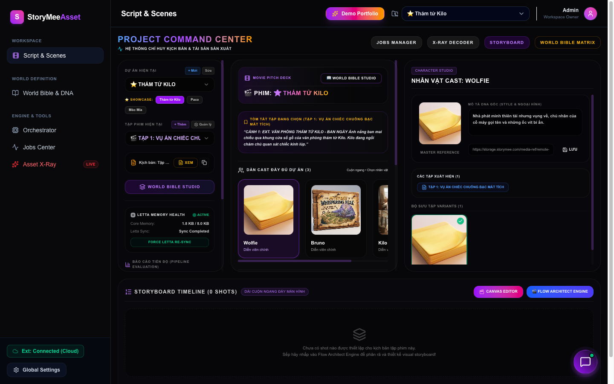
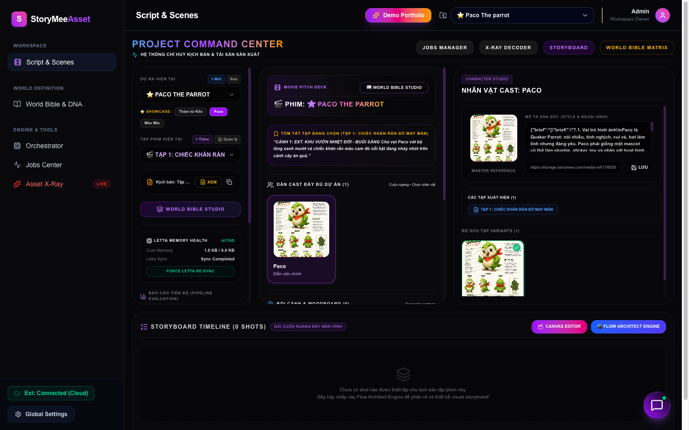
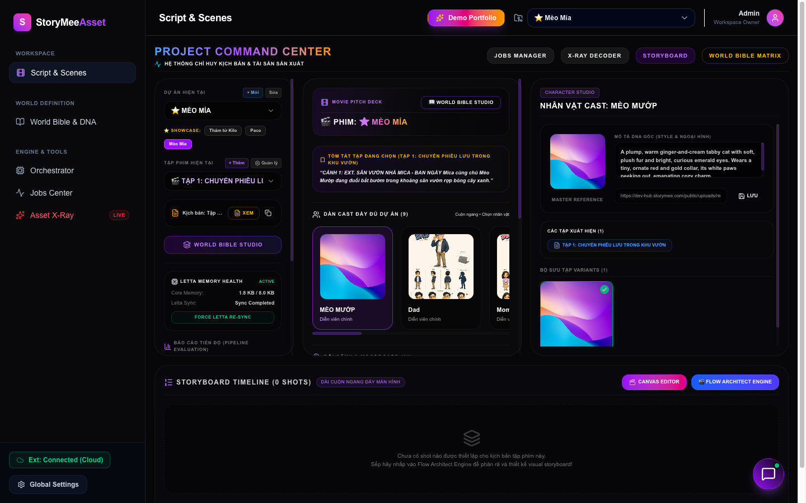
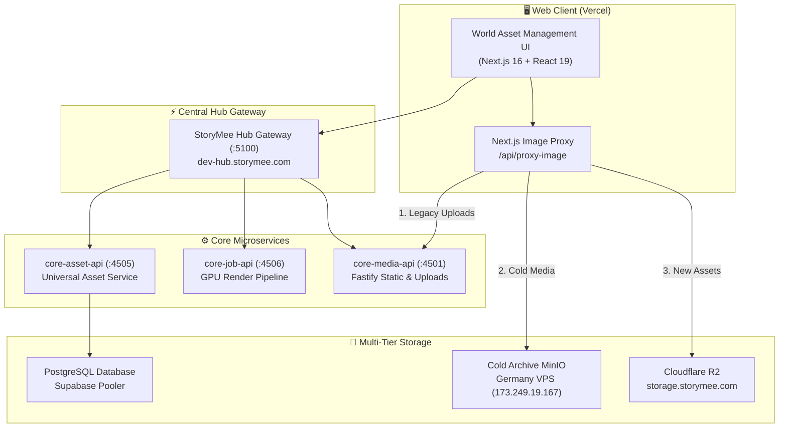

# 🌐 StoryMee World Asset Management (WAM Studio)

> **Universal Cinema AI Asset Command Center, Character DNA Registry & Multi-World Bible Engine**  
> *Hệ Thống Quản Trị Tài Sản Điện Ảnh AI, Thế Giới Quan Đa Vũ Trụ & Điều Phối Sản Xuất Hoạt Hình Thế Hệ Mới.*

[](https://world-assets.vercel.app)
[-black?style=for-the-badge&logo=next.js)](https://nextjs.org/)
[](https://react.dev/)
[](https://www.typescriptlang.org/)
[](https://tailwindcss.com/)
[](LICENSE)

---

## 🌟 Live Demo & Instant Showcase

Trải nghiệm trực tiếp hệ thống quản trị tài sản điện ảnh AI đang vận hành trên production:

* 🌐 **Production URL:** **[https://world-assets.vercel.app](https://world-assets.vercel.app)**
* 🎬 **Tích hợp Storyboard Studio:** **[https://storyboard-workflow.vercel.app](https://storyboard-workflow.vercel.app)**
* ⚡ **1-Click Showcase Selector:** Tại thanh công cụ bên trái màn hình, nhấp vào 3 nút Showcase nổi bật để khám phá ngay dữ liệu kịch bản và tài sản thực tế:
  * 🕵️ **Thám tử Kilo:** Dự án hoạt hình trinh thám — visual DNA nhân vật Kilo, Bruno, Wolfie, văn phòng thám tử, xưởng phát minh và các đạo cụ bí ẩn.
  * 🦜 **Paco The parrot:** Dự án phim phiêu lưu — chú vẹt Paco với bộ đạo cụ đặc trưng (Orange-Red Bandana, Wooden Bird Perch, Fruit Plate) và kịch bản phân cảnh chi tiết.
  * 🐱 **Mèo Mía:** Đại gia đình mèo hoạt hình — Mèo Mía, Bé Mai, Mica, Mom, Dad, Mèo Mướp, Mèo Vàng cùng toàn bộ bối cảnh căn hộ chung cư Hà Nội.

---

## 📸 Giao Diện Trực Quan (Interface Showcase)

### 1. Tổng Quan Dự Án & Cinematic Overview
Theo dõi tiến độ sản xuất thực tế (% DNA Assets, % Visual Storyboard, % Video Renders), dàn diễn viên (Cast), bối cảnh chính và timeline tập phim.



### 2. Quản Trị Nhân Vật & Đạo Cụ Paco
Hiển thị đầy đủ Master Reference Image, thông số đạo cụ 3D và biến thể hình ảnh độ nét cao.



### 3. Vũ Trụ Gia Đình Mèo Mía
Bộ sưu tập 9 nhân vật cốt lõi và 18 bối cảnh/đạo cụ được lưu trữ và tối ưu hóa qua Image Proxy đa tầng.



---

## 🚀 Tính Năng Nổi Bật (Core Capabilities)

### 👤 1. Character Profile Studio & Visual DNA Engine
* **Kiểm soát tính nhất quán (Visual Continuity):** Định nghĩa tỷ lệ cơ thể (Proportions), đặc điểm mắt/khuôn mặt, trang phục và bộ quy tắc cấm kỵ (Do's & Don'ts).
* **Bộ sưu tập biến thể (Variants Gallery):** Lưu trữ, duyệt và chọn Master Reference Image với một cú nhấp chuột.
* **Đồng bộ ký ức Letta AI:** Tự động đẩy DNA nhân vật và hồ sơ thế giới quan lên Letta Memory Agent để AI nhớ thuộc tính xuyên suốt các tập phim.

### 🗺️ 2. World Bible Matrix (Thế Giới Quan)
* **Ma trận bối cảnh (Locations) & Đạo cụ (Props):** Phân loại theo thẻ địa lý, mối quan hệ không gian kề cận (`adjacentLocationIds`) và cảm xúc ánh sáng.
* **Quy tắc nghệ thuật (Art Direction):** Khóa bảng màu (Color Palette), tỷ lệ khung hình và Lighting Guide cho từng vũ trụ IP riêng biệt.

### 🎬 3. Storyboard Timeline & Shot Detail Modal
* **Preview phân cảnh trực tiếp:** Xem chuỗi khung hình Storyboard theo thời gian thực tương ứng với từng tập kịch bản.
* **Bảng thông số đạo diễn:** Khám phá chi tiết góc máy (Camera Angle), cỡ cảnh (Shot Kind: Extreme Wide, Medium, Close-up) và hướng dẫn chuyển cảnh (Transitions).

### ⚡ 4. Multi-Tier Image Proxy & Resilience Architecture
* **Định tuyến dữ liệu đa tầng:** Tự động điều phối giữa Cloudflare R2, MinIO Cold Archive (Đức) và Core Media Server (Ubuntu VPS).
* **Zero Broken Images:** Hệ thống fallback thông minh tự nhận diện loại tài sản (`character`, `location`, `prop`) và trả về hình ảnh cinematic chất lượng cao nếu liên kết ngoại vi hết hạn.
* **Vercel Edge Caching:** Thiết lập `Cache-Control: public, max-age=31536000, immutable` đảm bảo ảnh tải tức thì với độ trễ tối thiểu.

### 🔗 5. Cầu Nối Song Hành Với Flow Architect
* Hoàn toàn độc lập với hệ thống giáo dục trẻ em (AIKids LMS).
* Liên kết trực tiếp hai chiều với **[Flow Architect](https://storyboard-workflow.vercel.app)** để phân rã kịch bản thô thành mạng lưới node trực quan.

---

## 🏗️ Kiến Trúc Hệ Thống (Architecture Flow)



---

## 🛠️ Công Nghệ Sử Dụng (Tech Stack)

| Thành phần | Công nghệ |
|---|---|
| **Frontend Framework** | [Next.js 16](https://nextjs.org/) (App Router, Turbopack) |
| **Giao diện & UI** | [React 19](https://react.dev/), [Tailwind CSS v4](https://tailwindcss.com/), [Lucide React](https://lucide.dev/) |
| **State & Store** | Zustand, React Custom Hooks, LocalStorage Persist |
| **Tối ưu hình ảnh** | Next.js Serverless Route Handler, Multi-tier Fetch Cache |
| **Gateway & Protocol** | Go Gateway (`storymee-hub` :5100), REST API, Bearer Auth |
| **Cơ sở dữ liệu** | PostgreSQL (Supabase Cloud + PgBouncer Pooling) |
| **Triển khai hạ tầng** | [Vercel](https://vercel.com/) (Global Edge Deployment) |

---

## 💻 Hướng Dẫn Cài Đặt & Vận Hành (Getting Started)

### Yêu cầu tiên quyết
* Node.js >= 20.x
* npm >= 10.x hoặc pnpm >= 9.x

### 1. Clone repository
```bash
git clone https://github.com/zuzziQ/world-asset.git
cd world-asset
```

### 2. Cài đặt dependencies
```bash
npm install
```

### 3. Cấu hình biến môi trường (`.env.local`)
Tạo file `.env.local` ở thư mục gốc:
```env
NEXT_PUBLIC_CORE_API_URL=https://dev-hub.storymee.com
NEXT_PUBLIC_HUB_GATEWAY_URL=https://dev-hub.storymee.com
NEXT_PUBLIC_HUB_API_KEY=sk-hub-komarz8252ey1mme
NEXT_PUBLIC_FLOW_ARCHITECT_URL=https://storyboard-workflow.vercel.app
```

### 4. Khởi chạy Development Server
```bash
npm run dev
```
Mở trình duyệt tại: **`http://localhost:3000`** (hoặc `http://localhost:3002`).

### 5. Build Kiểm Tra Sản Xuất
```bash
npm run build
```

---

## 📁 Cấu Trúc Thư Mục (Project Structure)

```
world-asset/
├── docs/
│   ├── screenshots/              # Ảnh chụp giao diện portfolio chất lượng cao
│   │   ├── dashboard-overview.png
│   │   ├── paco-showcase.png
│   │   └── meo-mia-showcase.png
│   └── API_SURFACE.md            # Đặc tả API Gateway
├── src/
│   ├── app/                      # Next.js App Router
│   │   ├── api/proxy-image/      # Image Proxy kết nối R2 & MinIO Đức
│   │   ├── character/[id]/       # Trang chi tiết Universal Asset Builder
│   │   ├── orchestrator/         # Điều hướng truy vấn tài sản
│   │   ├── tools/storyboard/     # Storyboard Studio
│   │   ├── tools/xray/           # X-Ray DNA Decoder
│   │   ├── world-bible/          # Ma trận thế giới quan
│   │   ├── layout.tsx            # Root layout
│   │   └── page.tsx              # Dashboard chính & điều phối dự án
│   ├── components/               # UI components dùng chung (Topbar, Sidebar)
│   ├── features/
│   │   ├── project-dashboard/    # Cast Studio, Timeline, Variants Gallery
│   │   ├── storyboard/           # Logic kịch bản & phân cảnh
│   │   ├── world-bible/          # Quản trị quy tắc vũ trụ IP
│   │   └── xray/                 # Reverse prompt & style analysis
│   └── lib/
│       ├── api.ts                # HTTP client & service endpoints
│       ├── apiClient.ts          # Core API axios interceptor
│       └── imageUrl.ts           # Universal image resolver & fallbacks
├── package.json
└── README.md
```

---

## 🤝 Liên Kết Hệ Sinh Thái StoryMee

* **World Asset Live:** [https://world-assets.vercel.app](https://world-assets.vercel.app)
* **Flow Architect Live:** [https://storyboard-workflow.vercel.app](https://storyboard-workflow.vercel.app)
* **GitHub Repository:** [https://github.com/zuzziQ/world-asset](https://github.com/zuzziQ/world-asset)
* **Organization:** StoryMee Cinematic AI Ecosystem
