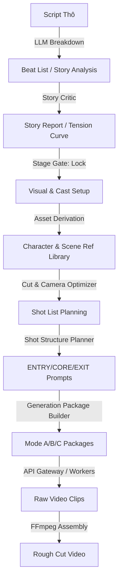

# ĐỀ XUẤT KIẾN TRÚC & PHƯƠNG ÁN TÍCH HỢP LÕI ĐIỆN ẢNH (PDR OS)

Chào Sếp, em đã phân tích cực kỳ chi tiết cách hoạt động của Git repository `movie-studio-main` (hệ thống Pre-Production Director Agent - PDR) và đối chiếu với Storyboard Tool hiện tại của dự án `world-asset-management` (WAM). 

Dưới đây là báo cáo phân tích sâu sắc nhất và đề xuất phương án tích hợp tối ưu để mang lại trải nghiệm làm phim AI liền mạch, giữ vững nhất quán nhân dạng (character consistency) và bối cảnh (environment cohesion).

---

## 1. PHÂN TÍCH CHUYÊN SÂU CƠ CHẾ HOẠT ĐỘNG CỦA `movie-studio-main`

Lõi của `movie-studio-main` là giải quyết điểm yếu lớn nhất của AI Video hiện nay: **sự đứt gãy và không nhất quán giữa các clip tạo độc lập** bằng việc áp dụng các quy chuẩn điện ảnh truyền thống thông qua một pipeline **Pre-Production Director Agent (PDR)**. 

Hệ thống hoạt động dựa trên 5 trụ cột kỹ thuật cốt lõi:



### 1.1. Quy trình 6 Creative Gates (Human-in-the-loop)
Hệ thống không chạy tự động 100% (auto-cascade) vì AI tạo ảnh/video luôn có xác suất lỗi. Thay vào đó, nó chia thành các Gate nghiêm ngặt, stage trước phải được khóa (`status: "locked"`) thì stage sau mới mở:
1. **Gate 1 - Brief**: Thiết lập mục tiêu, đối tượng, thông điệp cốt lõi và tông màu chủ đạo.
2. **Gate 2 - Story**: Bóc tách kịch bản thành các Beat thô. LLM tự động gán nhãn kịch bản (căng thẳng, biến chuyển tâm lý, câu hỏi kịch...).
3. **Gate 3 - Visual / Cast**: Khai báo danh sách nhân vật (Characters), bối cảnh (Environments) và đạo cụ (Props), đồng thời phân chia mức độ ưu tiên (`tier: "main" | "extend"`).
4. **Gate 3b - Assets (Duyệt nguyên liệu)**: Sinh bộ ảnh tham chiếu chuẩn hóa (nền trắng, ánh sáng flat, góc xoay, biểu cảm) cho nhân vật và bối cảnh. Chỉ những ảnh được người dùng bấm duyệt (`status: "approved"`) mới được đẩy xuống pha làm video.
5. **Gate 4-5 - Shots**: Lên sơ đồ chia shot máy, tự động tạo storyboard sketch. Duyệt storyboard -> Tạo video -> Duyệt video.
6. **Gate 6 - Assembly**: Khâu cuối, ráp nối các clip đã duyệt thành phim hoàn chỉnh.

### 1.2. Thuật toán Lượng hóa Rủi ro đứt gãy điểm nối (Discontinuity Risk)
Để mắt người không nhận ra sự thay đổi nhỏ về ngoại hình nhân vật giữa các clip tạo độc lập, hệ thống định lượng rủi ro điểm nối giữa shot `prev` và shot `cur` (`discontinuity_risk.py`):

*   **Rủi ro cơ bản (`base_transition_risk`)**:
    *   Nền tảng: `0.2` (mặc định rủi ro khi ghép 2 clip sinh độc lập).
    *   Cùng nhân vật xuất hiện: `+0.3` (rủi ro drift gương mặt/trang phục rất cao).
    *   Cùng cỡ cảnh liên tiếp (Wide -> Wide): `+0.25` (gây lỗi nhảy hình - jump cut).
    *   Góc máy trùng lặp hoặc vi phạm đường trục hành động:
        *   Cùng phía nhưng góc xoay quá gần ($<30^\circ$): `+0.25` (lỗi jump cut).
        *   Khác phía (vượt đường $180^\circ$): `+0.2` (mất phương hướng không gian).
    *   Cùng loại shot rộng/tĩnh liên tiếp: `+0.1` (gây nhàm chán nhịp điệu).
*   **Giảm chấn rủi ro (`transition_risk`)**:
    *   Nếu một trong hai shot là **Glue Shot** (ảnh bối cảnh/chi tiết chèn xen kẽ): `-0.3`. Mắt người bị chuyển hướng tập trung nên không so sánh trực tiếp nhân vật.
    *   Kỹ thuật cắt cảnh (`CutTechnique`) giúp giảm chấn:
        *   *Reaction Shot*: `-0.2` (cắt sang biểu cảm góc khác).
        *   *Cutaway*: `-0.25` (cận cảnh đồ vật/môi trường).
        *   *Cut on Action*: `-0.15` (mắt bám theo cử động nên bỏ qua lỗi nhỏ).
        *   *J-Cut/L-Cut*: `-0.1` (âm thanh đi trước/sau hình dẫn dắt não bộ).

### 1.3. Cơ chế tối ưu góc máy (30° và 180° Rules)
Quy hoạch camera tự động (`camera_angle_optimizer.py`):
*   **Quy tắc 180°**: Toàn bộ camera trong cảnh quay được gán cứng về một phía hành động (`side: "A"`), giới hạn phương vị góc máy xoay tối đa từ $0^\circ$ đến $170^\circ$ để tránh đảo ngược góc nhìn nhân vật.
*   **Quy tắc 30°**: Nếu hai shot liên tiếp chia sẻ cùng chủ thể nhân vật, máy quay bắt buộc phải xoay một góc tối thiểu là $30^\circ$ (bước xoay mặc định là $45^\circ$, tự động đảo hướng khi chạm biên $0^\circ$ hoặc $170^\circ$).

### 1.4. Cấu trúc Shot tự khép kín (ENTRY/CORE/EXIT)
Thay vì sinh clip ngẫu nhiên, prompt của từng shot được chia nhỏ thành 3 pha cấu trúc để phục vụ khâu cắt dựng (`shot_structure_planner.py`):
*   **ENTRY (15-20%)**: Thiết lập nhân vật đã ở vị trí sẵn sàng.
*   **CORE (60-70%)**: Thực hiện hành động chính mô tả trong beat.
*   **EXIT (15-20%)**: Tạo lối ra tự nhiên để chuyển tiếp mượt mà. Kiểu exit tự động thay đổi theo shot kế tiếp:
    *   Shot sau cắt theo hành động (`Cut on Action`) -> Exit dừng ở giữa cử động.
    *   Shot sau là góc biểu cảm (`Reaction`) hoặc chèn (`Cutaway`) -> Exit hướng nhân vật nhìn ra ngoài khung hình.
    *   Đổi scene / hết phim -> Exit lùi máy (zoom out) hoặc mờ dần (fade out).

### 1.5. Đóng gói Generation Package (Mode A/B/C)
Để tránh nhồi nhét quá nhiều thông tin tham chiếu làm model bị nhiễu màu, hệ thống giới hạn tối đa 5 ref/shot (tối ưu là 2-3) và chia làm 3 chế độ sinh:
*   **Mode A (Text-only)**: Dành cho shot bối cảnh trống, chuyển cảnh.
*   **Mode B (Storyboard + Text)**: Bố cục hình phức tạp, nhân vật phụ không cần chuẩn xác tuyệt đối.
*   **Mode C (Full Control)**: Tiêm tối đa 1 storyboard (bố cục), 1-2 character refs (nhân ảnh chính xác), và 1 scene ref (màu sắc/bối cảnh). Đặc biệt: **không trộn lẫn style ref với character ref** trên cùng một shot có nhân vật để tránh làm trôi nhân dạng.

---

## 2. ĐỐI CHIẾU VỚI THỰC TRẠNG CỦA `world-asset-management` (WAM)

Hiện tại, WAM đã sở hữu nền tảng UI Storyboard tương đối hoàn chỉnh, tuy nhiên vẫn tồn tại các khoảng trống kỹ thuật lớn so với bộ tiêu chuẩn điện ảnh của `movie-studio`:

| Tính năng | world-asset-management (Hiện tại) | movie-studio-main (Tiêu chuẩn) | Khoảng trống cần bù đắp |
| :--- | :--- | :--- | :--- |
| **Bóc tách Shot** | Đã có Parser phân tích lời thoại, bối cảnh từ kịch bản thô. | Phân tích sâu sắc cấu trúc Beat kịch (dramaturgy) + chấm điểm Story Critic. | Chưa đánh giá chất lượng cấu trúc kịch bản trước khi sinh shot. |
| **Quy hoạch góc máy** | Người dùng tự chọn góc thủ công hoặc sinh ngẫu nhiên. | Tự động tính toán góc xoay camera tránh trùng lặp góc (lỗi jump cut) và tuân thủ quy tắc 180°. | Thiếu bộ điều phối camera tự động (30°/180°). |
| **Quản lý điểm nối** | Các clip được xếp cạnh nhau trực tiếp. | Đo lường Cohesion Score, tự động đề xuất chèn Glue Shot (cutaway/reaction). | Chưa có công thức lượng hóa rủi ro nhảy hình, chưa có Glue shot tự động. |
| **Prompt Engineering** | Viết prompt thô tả hành động của shot. | Cấu trúc hóa prompt 3 pha (ENTRY / CORE / EXIT) giúp clip tự khép kín để cắt dựng. | Prompt của shot còn lỏng lẻo, chưa tối ưu cho thuật toán dựng. |
| **Image References** | Sử dụng toàn bộ DNA assets được gán. | Lọc thông minh (Ref Budget $\le 5$), chọn góc ref khớp camera, chọn biểu cảm khớp emotion. | Thiếu bộ lọc tối ưu hóa reference trước khi đẩy qua API tạo video. |
| **Âm thanh** | Chưa thiết kế luồng âm thanh chi tiết. | Lên kế hoạch sound design 4 lớp (Score liên tục, Ambient bối cảnh, SFX hành động, Voice hội thoại). | Chưa có sơ đồ dựng âm thanh để làm "keo dán" liền mạch. |

---

## 3. PHƯƠNG ÁN TÍCH HỢP TỐI ƯU NHẤT (PROPOSAL DESIGN)

Để giữ cho WAM gọn nhẹ, dễ bảo trì và vận hành với hiệu suất cao nhất, em đề xuất **Phương án lai (Hybrid Approach)**:

> [!TIP]
> **Chiến lược Hybrid**: Chuyển đổi toàn bộ logic tính toán điện ảnh (toán học, quy tắc camera, rủi ro đứt gãy, đóng gói prompt) sang **Typescript** để chạy trực tiếp trên Next.js client-side/server-side. 
> Việc sinh ảnh (multimodal generation) và video sẽ gọi qua hệ thống API Gateway có sẵn của hệ sinh thái (`omni-core-api` và các GFlow workers ở Tầng 5).

```
[ WAM Next.js Storyboard UI ]
         │
         ▼
[ utils/directorPlanning.ts (Typescript Core) ] 
 ├── Camera Angle Optimizer (30° & 180° Rules)
 ├── Transition Discontinuity Risk Evaluator
 ├── Glue Shot Auto-Inserter
 ├── ENTRY/CORE/EXIT Prompt Packager
 └── Audio 4-Layer Planner
         │
         ▼
[ API Gateway (omni-core-api/stealth-gateway) ] ──► [ AI Generation Workers (Tầng 5) ]
```

### 3.1. Kế hoạch triển khai mã nguồn chi tiết

#### Bước 1: Tạo các file lõi Director Engine bằng Typescript
Ta sẽ tạo thư mục mới `src/app/tools/storyboard/utils/director/` để chứa các module tính toán độc lập:
*   `cameraOptimizer.ts`: Thực thi thuật toán gán góc máy, tính độ lệch bearing tối thiểu $30^\circ$, khóa camera ở một phía (Side A).
*   `riskEvaluator.ts`: Tính toán rủi ro điểm nối giữa 2 shot. Định vị các điểm nối có rủi ro cao ($\ge 0.6$).
*   `gluePlanner.ts`: Tự động chèn shot `GLUE` (cutaway chi tiết hoặc reaction) vào danh sách shot để che giấu lỗi AI.
*   `shotPackager.ts`: Cấu trúc hóa prompt thành các khối `[STYLE]`, `[ENTRY]`, `[CORE]`, `[EXIT]`, `[CAMERA]`, `[LIGHTING]`. Lọc thông minh reference ảnh (chỉ lấy góc khớp camera hoặc biểu cảm khớp shot).
*   `audioPlanner.ts`: Lên timeline 4 lớp âm thanh cho cảnh quay để bám theo giây của các shot.

#### Bước 2: Tích hợp vào luồng sinh shot tự động (`generateExpandedShots.ts`)
Khi người dùng bấm "Bóc tách kịch bản", thay vì chỉ sinh shot thô như hiện tại, WAM sẽ chạy chuỗi pipeline:
1. Sinh danh sách shot thô ban đầu từ beats.
2. Chạy `riskEvaluator` và `gluePlanner` để chèn tự động các shot Glue ở những điểm nối rủi ro.
3. Chạy `cameraOptimizer` để gán góc máy, cỡ cảnh, đảm bảo tính đa dạng (framing variety) và quy tắc 180/30.
4. Chạy `shotPackager` tạo prompt tự khép kín và gán tập `image_refs` tối ưu.
5. Chạy `audioPlanner` tạo danh sách cue âm thanh.

#### Bước 3: Cải tiến giao diện Storyboard UI (WAM)
*   **Hiển thị chỉ số Cohesion (Độ liền mạch)** của toàn scene dựa trên trung bình rủi ro các điểm nối.
*   **Đánh dấu trực quan các điểm nối High Risk** trên UI bằng biểu tượng cảnh báo hoặc màu sắc.
*   **Hiển thị chi tiết góc camera**, kiểu cắt cảnh (`cut_in`), cấu trúc prompt (`ENTRY`/`CORE`/`EXIT`) trên thẻ `ShotCard`.
*   **Cho phép bấm "Chèn Glue Shot" thủ công** trực tiếp giữa hai shot bất kỳ trên UI.

---

## 4. KẾ HOẠCH HÀNH ĐỘNG THỰC TẾ (ACTION ROADMAP)

Để đảm bảo an toàn tuyệt đối cho hệ thống đang chạy ổn định của WAM, em đề xuất lộ trình từng bước:

### Pha 1: Hiện thực hóa Thuật toán Director trên Typescript
Em sẽ viết các helper functions tính toán góc máy, rủi ro và đóng gói shot vào một module sạch sẽ trong thư mục `utils/director`. Đây là code thuật toán thuần túy nên không gây rủi ro phá vỡ UI hiện tại.

### Pha 2: Nâng cấp kiểu dữ liệu (Types)
Cập nhật file `src/app/tools/storyboard/types.ts` để lưu trữ các thuộc tính mới của Shot (như `cameraAngle`, `cutIn`, `isGlue`, `structure`, `imageRefs` cụ thể).

### Pha 3: Ghép nối vào UI và Kiểm thử
Cập nhật giao diện hiển thị để người dùng nhìn thấy các góc máy được tối ưu và chỉ số Cohesion, sau đó thực hiện test kiểm chứng bằng công cụ duyệt tự động.

Sếp đánh giá phương án này thế nào ạ? Nếu Sếp duyệt, em sẽ bắt đầu triển khai **Pha 1** ngay lập tức.
